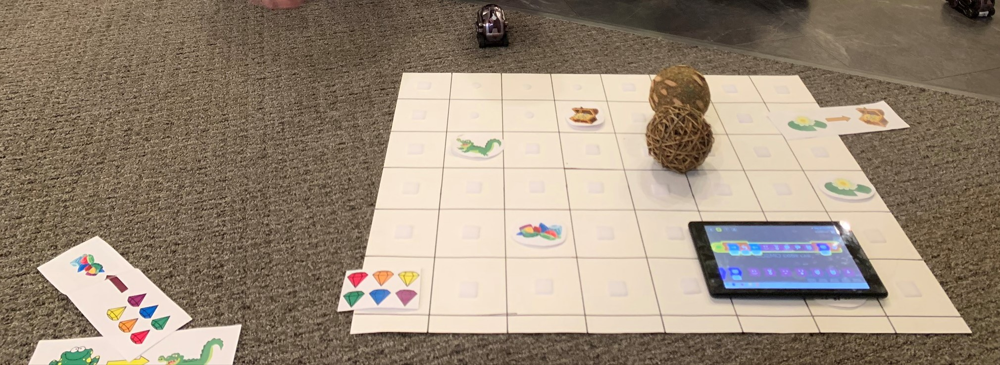

# Block Programming with Cozmo
#### Grades: K-2nd
#### Time for Set-up: 10 mins
#### Time for lesson: 1 hour
#### Learning Objectives: 
  * Students will be introduced to block programming, and become familiar with some of the rudimentary commands available to them.
  * Students will become familiar with how to move Cozmo using the tablet.
  * Students will be able to use the block programming and to think critically about Cozmo's movement.
#### Learning Outcomes: 
  * Students will be able to move Cozmo forward using block commands. They will also be able to turn Cozmo right and left using block commands. 
  * Students will be able move Cozmo from the starting point to the endpoint of the path that is determined by the instructor. 
#### Material Needed:
  * Cozmo robots
  * Tablets (or some other device that you can control Cozmo with)
  * Boards for Cozmo to move on
    * Our group used large pieces of posterboard.
    * Markers draw the squares on the posterboard.
    * A straight edge to make the squares even.
  * Start and finish markers
    * Our group used printed and cut out pieces of clipart.
    * We used sticky velcro to secure the pieces to the board.
  * Cards to show the students what marker Cozmo should start on and which marker he should end on.
  * Obstacles to place on the game boards to provide a challenge for students while navigating the board.
#### Set-Up:
  * Take a large, square piece of cardboard or paper and draw small squares on the board like a grid.
    * The squares should be even width and height.
    * Feel free to create this on a computer and print the board if you prefer
  * Place start and finish cards on the board. 
    * We used cut outs of clipart.
    * The start and finish should be flat so Cozmo can move onto that piece.
    * Tape or velcro can be used to secure the start and end pieces to the board.
  * Link Cozmos to Kindle tablets. Organize these to ensure that each Cozmo’s tablet is known and easily identified.
#### Lesson Plan:
###### Opener:
  * Short demonstration of Cozmo and block programming.
    * Cover general rules, such as taking care of the Cozmos, and respecting one another’s learning environments.
  * Break students up into groups of 3-4 (or smaller). 
  * Cozmo/tablet pairs will be given to each student, as well as a card that identifies each student’s start and end point. 
###### Main Activities:
  * Make sure that students understand the objective, and begin assisting students to get from start to finish. 
  * Once a student has been able to perform their designated route, instructor may change the board in order to give the students more chances to practice.
  * After roughly 10-15 minutes, students will gather together in a circle for discussion about what was hard/easy & liked/disliked.
###### Extended Learning:
  * If the lessons are too simple, additional steps or logic may be introduced. 
      * Some students will enjoy learning how to implement looping structures. 
      * Others may react well to slightly more difficult challenges that include more turns or obstacles. 
###### Closure:
  * At the end of the lesson, students will gather one final time in a circle. This gives students a chance to discuss their favorite parts of the activity, the things they learned, and the things they found difficult. Should students have questions, this also acts as a forum for discussion.
#### Possible Issues
  * Cozmo robots can randomly die, so make sure there are some extra robots that are ready for a quick exchange.
  * The track may be too difficult for some students.
    * Have them try driving Cozmo instead of using block programming.
    * After student makes attempt, allow them to play with some of Cozmo’s dance features. This will keep the student involved, while still engaging them in an aspect of technology.
  * There are too many students per instructor.
    * Give students the opportunity to pair program. This engages collaborative thinking and allows them to potentially solve challenges together.
#### Image of the Board from our Lesson

