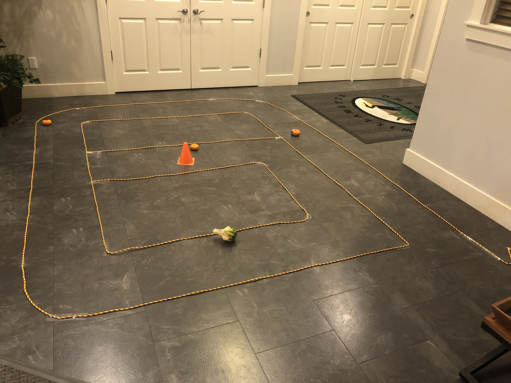
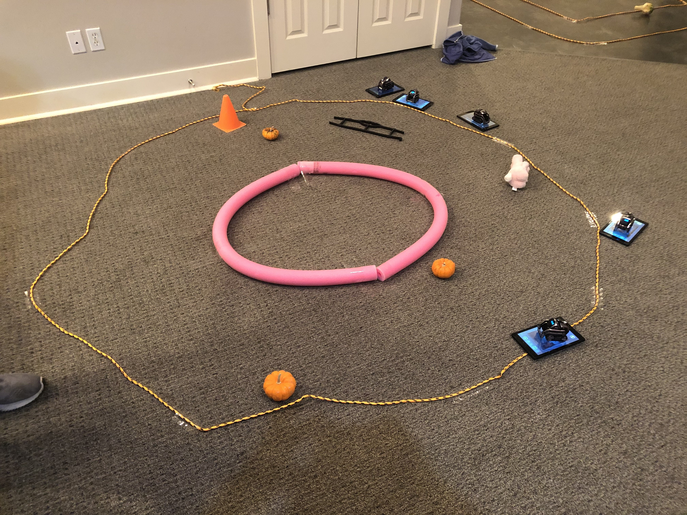

# Explore with Cozmo
#### Grades: K-2nd
#### Time for Set-up: 20 mins
#### Time for lesson: 1 hour
#### Learning Objectives: 
  * Understand the basics of Cozmo and how he moves.
  * Students will become more comfortable using robots and tablet technology.
#### Learning Outcomes: 
  * Students will be able to move Cozmo forward, backward, and turn him using the tablet controls.
  * Students will be able to maneuver Cozmo through tracks.
#### Material Needed:
  * Cozmo robots
  * Tablets (or some other device that you can control Cozmo with)
  * For Tracks:
    * Rope (to create track)
    * Pool Noodles (to create track)
    * Small Obstacles
    * Tape to secure rope and pool noodles
#### Set-Up:
  * Create one or more tracks based on the number of students.
  * The tracks can be in any configuration. They can have obstacles and can be as long as desired.
  * The tracks can be made from anything, just make sure they are clearly laid out.
  * Link Cozmos to Kindle tablets. Organize these to ensure that each Cozmo’s tablet is known and easily identified.
#### Lesson Plan:
  * Short demonstration of Cozmo.
    * Cover general rules, such as taking care of the Cozmos, and respecting one another’s learning environments.
  * Cozmo/tablet pairs will be given to each student
  * Students manuever Cozmo around track avoiding obstacles.
   * Students should use Cozmo's driving feature.
  * After students finish a track, pull the group together.
    * Have students discuss what they learned, liked, and disliked about the course.
  * Repeat activity with the another track.
#### Possible Issues
  * Cozmo robots can unexpectedly run out of battery, so make sure there are some extra robots that are ready for a quick exchange.
  * If the barriers (like the rope) that form the walls of the track are not tall enough then the robots may accidently exit the course and have a difficult time getting back on.
#### Images of Tracks from our Lesson

